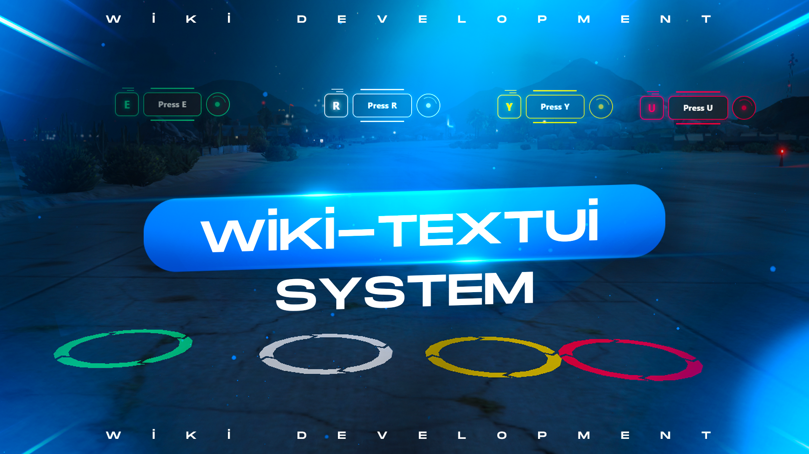

# wiki-textui
## in-game showroom
https://youtu.be/mBwvHKCKMhw



Wiki TextUI DrawText Function
Usage:

```lua
exports['wiki-textui']:DrawText(key, text, coords,color,marker)
```

Example:

```lua
exports['wiki-textui']:DrawText('E', 'Press E', vector3(1597.3583, 3234.2361, 40.4798), 'green', false)
```

---

## Progress Bar

Usage:

```lua
exports['wiki-textui']:Progress(barType, duration, color)
```

Example:

```lua
exports['wiki-textui']:Progress('bar', 6000, 'green')

exports['wiki-textui']:Progress('circle', 6000, 'green')
```